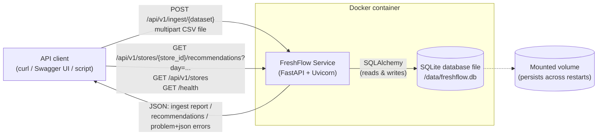
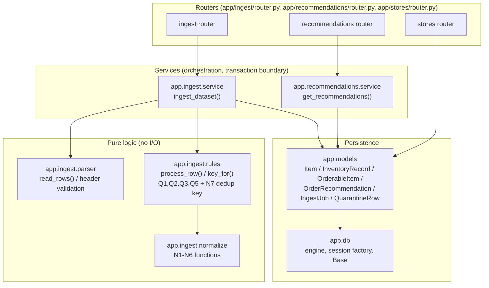
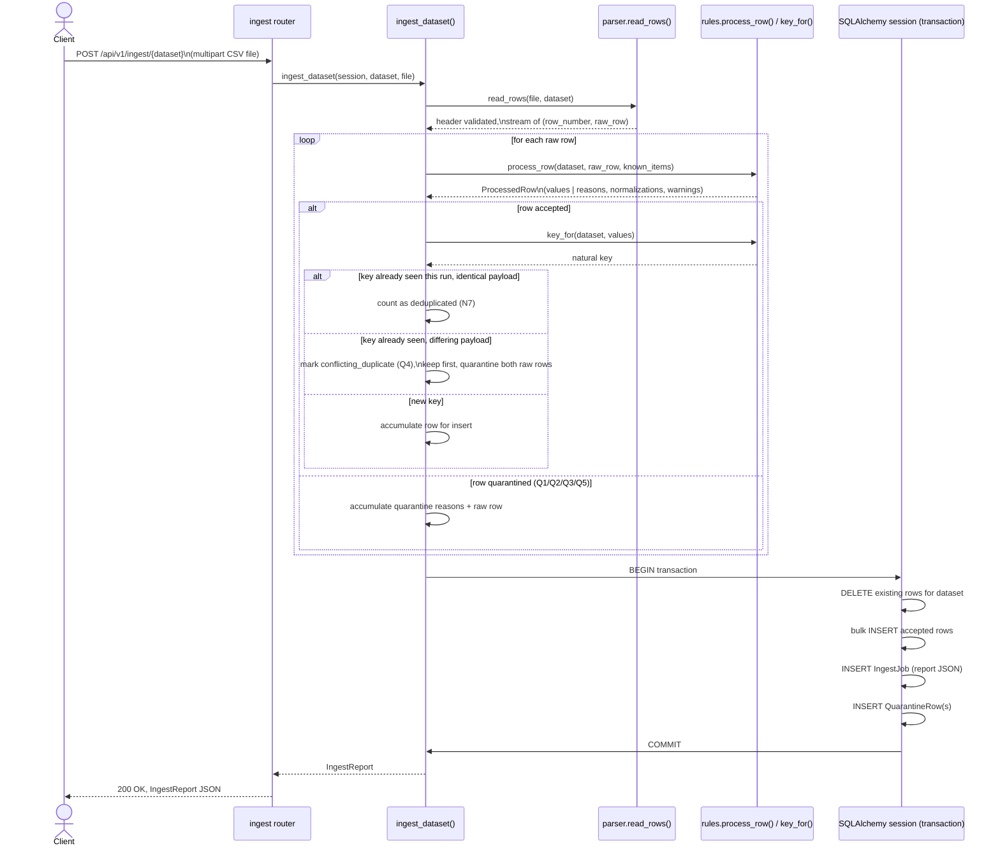
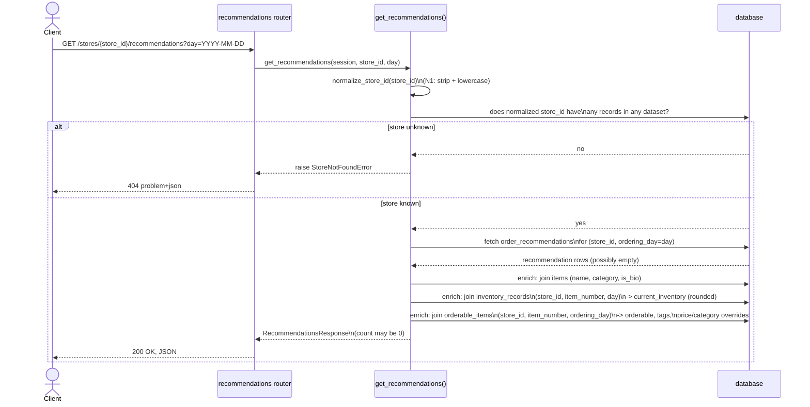

# FreshFlow — Architecture

This document describes the FreshFlow service's runtime architecture, its
internal package structure, its data model, and the two behaviors most
worth understanding precisely: how ingest achieves atomic replace-per-dataset
semantics, and how tests get an isolated database without the application
code having to know it's under test. Diagrams are Mermaid; render them with
any Mermaid-aware viewer (GitHub renders them natively) or `mmdc`.

For the domain background and the data-quality rationale behind the ingest
pipeline, see [PROBLEM_ANALYSIS.md](PROBLEM_ANALYSIS.md),
[DATA_GUIDE.md](DATA_GUIDE.md), and [DATA_QUALITY.md](DATA_QUALITY.md). For
the reasoning behind individual technology and design choices, see the
[ADRs](adr/).

---

## 1. Container / context view

FreshFlow runs as a single Docker container. An HTTP client (a person using
`curl`/Swagger UI, or an automated caller) uploads the four challenge CSV
files and queries recommendations; the service persists everything to a
SQLite database file, which should live on a mounted volume so data
survives container restarts (`FRESHFLOW_DB_PATH`, defaulting to
`/data/freshflow.db` inside the container — see the `Dockerfile` and
[ADR-002](adr/ADR-002-storage.md)).

The only external inputs are the four CSV files (`items`, `inventory`,
`orderable_items`, `order_recommendations`); the only outputs are JSON —
ingest reports, recommendation responses, quarantine audit pages, and RFC
9457 `application/problem+json` error bodies ([ADR-011](adr/ADR-011-error-format.md)).
There is no second container and no external database service
([ADR-002](adr/ADR-002-storage.md)): `docker build && docker run` is
sufficient.

---

## 2. Component view

Inside the application, packages are layered strictly: **routers are thin**
(HTTP concerns only — path/query parameters, the injected DB session, and
calling exactly one service function), **services orchestrate** (own the
transaction boundary, call into the pure rule/normalization/parser
functions, build response and report objects), and **rules/normalize/parser
are pure** (no I/O, no database access, no FastAPI imports — they take
values in and return values or raise `ValueError`). Models and `db.py` sit
underneath everything as the persistence layer.

`app.common.enums` (`DatasetKind`, `ReasonCode`) is shared vocabulary
imported by the parser, rules, models, and schemas alike, and is
deliberately dependency-free to avoid import cycles between `app.ingest`
and `app.schemas`.

---

## 3. Data model (ER diagram)

Six tables, matching `app/models/`. `items` is the shared catalog; the
three per-store tables (`inventory_records`, `orderable_items`,
`order_recommendations`) each carry a `(store_id, item_number, ...)`
uniqueness constraint and reference `items.item_number` logically (there is
no enforced foreign key, since Q2/unknown-item rows and items-before-ingest
ordering are explicitly allowed — see [ADR-004](adr/ADR-004-csv-upload-contract.md)).
`ingest_jobs` and `quarantine_rows` record ingest history and audit data.

```mermaid
erDiagram
    ITEMS {
        int item_number PK
        string name
        string category
        bool is_bio
        decimal purchase_price
        decimal suggested_retail_price
    }
    INVENTORY_RECORDS {
        int id PK
        string store_id
        int item_number
        date day
        decimal quantity
    }
    ORDERABLE_ITEMS {
        int id PK
        string store_id
        int item_number
        date ordering_day
        date delivery_day
        decimal purchase_price
        decimal suggested_retail_price
        decimal profit_margin
        json tags
        string category
    }
    ORDER_RECOMMENDATIONS {
        int id PK
        string store_id
        int item_number
        date ordering_day
        date delivery_day
        int recommended_quantity
    }
    INGEST_JOBS {
        string ingest_id PK
        string dataset
        datetime created_at
        json report
    }
    QUARANTINE_ROWS {
        int id PK
        string ingest_id FK
        int row_number
        json raw_row
        json reasons
    }

    ITEMS ||--o{ INVENTORY_RECORDS : "item_number (logical)"
    ITEMS ||--o{ ORDERABLE_ITEMS : "item_number (logical)"
    ITEMS ||--o{ ORDER_RECOMMENDATIONS : "item_number (logical)"
    INGEST_JOBS ||--o{ QUARANTINE_ROWS : "ingest_id"
```

Unique constraints (not expressible in the diagram above): `inventory_records`
on `(store_id, item_number, day)`; `orderable_items` and
`order_recommendations` on `(store_id, item_number, ordering_day)`. Indexes
exist on every `(store_id, *_day)` query path to support the
recommendations query.

---

## 4. Ingest sequence

Every `POST /api/v1/ingest/{dataset}` call follows the same pipeline:
stream-parse, process each row (normalize + validate), deduplicate by
natural key, then atomically replace the dataset's rows and persist the
report and any quarantined rows — all inside one transaction, so a failure
partway through never leaves the dataset half-updated
([ADR-009](adr/ADR-009-replace-per-dataset-ingest.md)).

If the transaction fails for any reason, it rolls back in full: the
dataset's previously loaded rows remain exactly as they were before the
call, and no partial `IngestJob`/`QuarantineRow` records are left behind.
This is what "atomic replace" means concretely — there is no intermediate
state where a client polling `GET /api/v1/stores` could observe a
half-replaced dataset.

---

## 5. Request flow: `GET /api/v1/stores/{store_id}/recommendations`

A malformed `day` query parameter never reaches the service function at
all: FastAPI's own parameter validation (backed by the `date` type
annotation on the route) rejects it with a `422` before
`get_recommendations` is called. A known store with zero recommendations
for the requested day returns `200` with an empty `recommendations` list,
not a `404` — `404` is reserved for a `store_id` with no records in the
system at all, matching PLAN.md §3.2.

---

## 6. Layering rules, in practice

- **Routers are thin.** A router function's body is: accept
  framework-validated parameters (including the injected DB session via
  `SessionDep`, see §7), call exactly one service function, and return its
  result (or let a raised domain exception propagate to the exception
  handlers registered in `app.main.create_app`). No router file imports
  `app.ingest.normalize` or `app.ingest.rules` directly — only the service
  layer does.
- **Services orchestrate.** `app.ingest.service.ingest_dataset` owns the
  ingest transaction boundary and drives the parse → process → dedupe →
  load → report pipeline; `app.recommendations.service.get_recommendations`
  owns the store-existence check and the three enrichment joins. Services
  are the only layer that both talks to the database *and* calls into the
  pure rule functions — they are where I/O and business logic meet.
- **Rules are pure.** `app.ingest.parser`, `app.ingest.normalize`, and
  `app.ingest.rules` take plain values in and return plain values (or raise
  `ValueError`/`HeaderError`) — no `Session`, no FastAPI imports, nothing
  that requires a running application to exercise. This is what makes them
  unit-testable with plain table-driven `pytest` cases and directly
  traceable to rule IDs N1–N7/Q1–Q5 in their docstrings (see
  [DATA_QUALITY.md](DATA_QUALITY.md)).

---

## 7. Engine and session override for tests

`app/db.py` deliberately keeps **one module-level "current" engine and
session-factory pair** (`_engine`, `_session_factory`), built lazily from
`app.config.get_settings()` on first use via `get_engine()` /
`get_session_factory()`. Production code (`app.main.lifespan`,
`app.db.get_session`) always goes through these module-level accessors — it
never constructs an engine directly — so there is exactly one place that
decides "which database are we talking to."

Tests need a different, isolated database per test, without the
application code having any test-specific branch to make that happen.
`tests/conftest.py` achieves this two ways at once, and both point at the
*same* isolated engine so they can't disagree:

1. The `engine` fixture creates a fresh SQLite database inside pytest's
   per-test `tmp_path`, then calls `app.db.configure_engine(test_engine)`
   — this replaces the module-level "current" engine and session factory
   for the duration of the test. Anything that calls `get_engine()` or
   `get_session()` after this point (including `app.main`'s `lifespan`,
   which runs `init_db(get_engine())` on app startup) transparently gets
   the isolated test database, with no code change required in `app.db`
   or `app.main`.
2. The `client` fixture additionally overrides the `get_session` FastAPI
   dependency directly (`app.dependency_overrides[get_session] = ...`)
   with a session factory bound to that same isolated engine. This is
   belt-and-suspenders: FastAPI's dependency-override mechanism is the
   textbook way to substitute a test double for `Depends(get_session)`,
   and using it here (bound to the *same* engine `configure_engine`
   already installed) means both the app's own lifespan-created engine and
   every request's injected session are provably looking at the identical
   database file — there's no scenario where the app "sees" a different
   database than the test's own `session` fixture does.

Each test therefore gets a private SQLite file, is fully isolated from
every other test, and never touches the default `./freshflow.db` path —
without `app/db.py` containing a single `if TESTING` branch. This is the
actual mechanism as implemented (`app/db.py`, `tests/conftest.py`), not an
aspirational description: `configure_engine` is a general-purpose "install
a new current engine" function used by both application startup
(indirectly, via lazy `get_engine()`) and tests (directly, in the `engine`
fixture).
