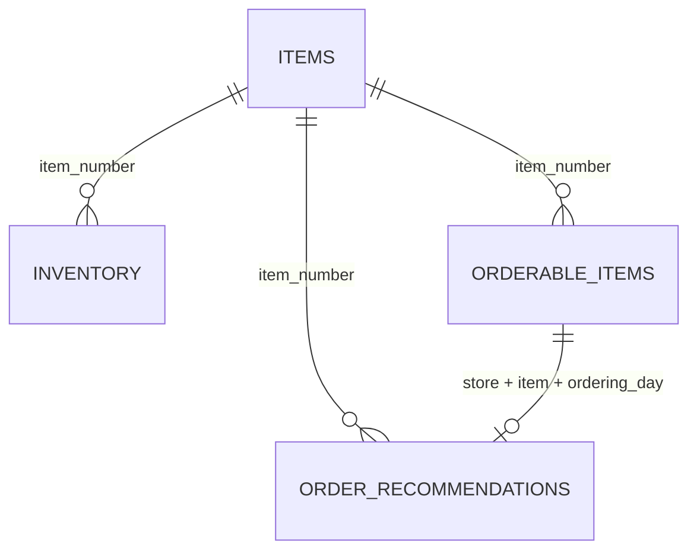

# FreshFlow — Data Guide (for developers new to the domain)

*This document explains, in plain language, what each data file represents, what is wrong with the data, and exactly what the cleansing pipeline does about it — including why certain records are excluded. It is the human-readable companion to the formal rules (N1–N7, Q1–Q5) defined in [DATA_QUALITY.md](DATA_QUALITY.md) and implemented in `app/ingest/`, and the reference document for the data-engineering agent (A2). All counts below were measured on the actual files.*

---

## 1. The four files and what they represent

Think of the dataset as answering four questions about two grocery stores (`store_a`, `store_b`) over the year 2024.

### `items.csv` — "What products exist?" (50 rows)

The product catalog, shared by both stores. One row per product.

| Column | Meaning | Example |
|---|---|---|
| `item_number` | Unique product ID | `1001` |
| `name` | Product name | `Organic Bananas` |
| `category` | Product group | `Fruits` / `Vegetables` |
| `is_bio` | Organic product? | `True` |
| `purchase_price` | What the store pays per piece (€) | `0.89` |
| `suggested_retail_price` | What the customer pays (€) | `1.49` |

### `inventory.csv` — "How much is on the shelf?" (~25,900 rows)

One row per store, per item, per day: the stock count that morning. Example: *store_a had 16.4 pieces of item 1001 on 2024-01-01.* This is the "how much do I already have?" input to an ordering decision.

### `orderable_items.csv` — "What can be ordered today, and when does it arrive?" (~25,200 rows)

Suppliers don't deliver everything every day. One row here means: *on this ordering day, this store may order this item, and it will arrive on this delivery day* (1–2 days later). Rows also carry the prices valid for that window, a computed `profit_margin`, and optional `tags` like `new`, `on_sale`, `price_change`.

### `order_recommendations.csv` — "How much should the store order?" (~25,600 rows)

The output of FreshFlow's forecasting: one row per store, item, and ordering day with the `recommended_quantity` (whole pieces) and the expected `delivery_day`. **This is the file our API mainly serves.** The other three enrich it: the catalog gives names and prices, inventory gives shelf context, orderable windows confirm the order is actually placeable.

How they connect (simplified):

---

## 2. What is wrong with the data

Real-world data pipelines merge exports from cash registers, supplier systems, and hand-edited spreadsheets — and it shows. Every defect below exists in the actual files; none are hypothetical.

| # | Defect | Where | Measured size | Concrete example |
|---|---|---|---|---|
| D1 | Store IDs spelled inconsistently (casing, stray spaces) | all per-store files | ~1,300 rows | `STORE_A`, `" store_a"`, `"store_a "` |
| D2 | Item numbers written as decimals | order_recommendations | ~650 rows | `"1001.0"` instead of `1001` |
| D3 | Two date formats in one column | inventory | 803 rows | `23/01/2024` amid `2024-01-23` |
| D4 | Fractional stock counts despite "whole pieces" | inventory | ~22,400 rows | `16.4` pieces |
| D5 | Negative recommended quantities | order_recommendations | 515 rows | `recommended_quantity = -5` |
| D6 | References to products missing from the catalog | all per-store files | ~950 rows | items `1099`, `9901`, `9902`, `9903` |
| D7 | Exact duplicate rows | all per-store files | 610 keys | same store+item+day appears twice with identical values |
| D8 | Casing/whitespace noise in categories, tags, names | items, orderable_items | ~1,500 values | `FRUITS`, `"new  "`, `"Cucumber  "` |
| D9 | Recommendations without a matching order window (and vice versa) | cross-file | ~3,600 / ~3,300 keys | a recommendation exists but orderable_items has no row for that store+item+day |

---

## 3. What the cleansing pipeline does — and why

The pipeline sorts every incoming row into one of three outcomes. The guiding principle: **repair only what has exactly one reasonable interpretation; never guess; never lose anything silently.**

1. **Load** — the row is fine (possibly after safe repairs).
2. **Load with a note** — the row is loaded, but the ingest report flags something worth knowing.
3. **Quarantine** — the row is *not* loaded into the live tables, but stored raw in a quarantine table with a reason code, retrievable via the API. Nothing is deleted.

### 3.1 Safe repairs (normalizations N1–N5, N7)

These fix defects where the intended value is beyond doubt:

- **D1 → N1:** `" STORE_A "` becomes `store_a` (trim + lowercase). There are only two real stores; every variant maps cleanly onto one of them. *Why repair rather than reject:* rejecting would throw away ~1,300 perfectly good rows over formatting.
- **D2 → N2:** `"1001.0"` becomes `1001` — but **only** when the decimal part is exactly zero. `"1001.5"` would be quarantined instead, because half an item number means the value is corrupt, and guessing between 1001 and 1002 could attach data to the wrong product.
- **D3 → N3:** dates are parsed as ISO (`2024-01-23`) first, then as day-first `DD/MM/YYYY`. *How we know slash dates are day-first and not US month-first:* the data contains `23/01/2024` and `31/12/2024` — there is no 23rd or 31st month, so day-first is proven. A date that fits neither format is quarantined (a wrong date is worse than a missing row: it would show the recommendation on the wrong day).
- **D8 → N4/N5:** categories and tags are trimmed and canonicalized (`FRUITS` → `Fruits`, `"new  "` → `new`); names are trimmed. Purely cosmetic variants of the same value would otherwise break grouping and filtering.
- **D7 → N7:** exact duplicates are collapsed to one row. We verified that **all** duplicate keys in these files carry identical values, so dropping the copies loses nothing — the report counts them. (If two rows with the same key ever *disagreed*, we would load the first and quarantine both raw versions as `conflicting_duplicate` — because then we genuinely don't know which is true, and we won't guess.)

### 3.2 Loaded with a note

- **D4 (fractional inventory):** `16.4` pieces contradicts the README ("all quantities are in pieces") but is probably real information — items sold by weight, partial crates, or shrinkage accounting. Rounding at ingest would destroy the original value forever. So we **store exactly `16.4`**, count it in the report as a warning, and let the API present a rounded whole number for display. *Why not quarantine:* that would discard 22,000 rows — 87% of the inventory file — over a formatting expectation.
- **D9 (recommendation without an order window):** this could be a legitimate business situation (the window file is incomplete, or the recommendation was computed before the supplier calendar changed). The row itself is internally valid, so we load it and mark it `orderable: false` in API responses, with a warning in the report. *Why not quarantine:* unlike a negative quantity, nothing about the row itself is wrong — only its cross-file context is incomplete, and we'd rather show the recommendation with a caveat than hide it.

### 3.3 Quarantined — excluded from live data, kept for audit

These rows are excluded because **using them would produce wrong or meaningless answers, and no repair is defensible.** Each gets a reason code the API reports.

- **D5 → Q1 `negative_quantity` (515 rows):** "Order −5 strawberries" is not an instruction a store can act on. It's most likely a bug upstream (perhaps a return or a forecast underflow), but *we don't know*, and turning −5 into 0 or 5 would be inventing data. Excluding it is the only honest option — and the report makes the exclusion visible so the upstream team can investigate.
- **D6 → Q2 `unknown_item` (~950 rows):** items `1099` and `9901–9903` appear in the per-store files but not in the catalog. Without a catalog entry we know neither name, nor price, nor category — an API response of "order 21 pieces of *unknown product*" helps no one and suggests the row belongs to a decommissioned or test article (the 99xx numbering hints at test data). If the catalog is later re-uploaded *with* these items, re-ingesting the files recovers the rows — quarantine is reversible by design.
- **Q3 `invalid_value` / `missing_field`:** anything unparseable after N1–N5 (a date that fits no known format, a non-numeric quantity, a missing required column value). We can't repair what we can't interpret.
- **Q5 `invalid_date_order`:** a delivery day *before* the ordering day would mean the goods arrive before they were ordered — physically impossible, so the row is corrupt.

### 3.4 The one-sentence test for every rule

> **If a reasonable colleague could disagree about what the correct value is, we don't repair — we quarantine and report.**

That's the entire philosophy. Trimming whitespace passes the test (no one disagrees). Flipping −5 to +5 fails it. Everything in sections 3.1–3.3 is just this sentence applied case by case.

---

## 4. What the ingest report shows the uploader

Every upload answers: *how many rows arrived, how many were loaded, what was repaired (per rule), what was excluded (per reason), and what deserves attention* — as machine-readable JSON (schema documented in [ARCHITECTURE.md](ARCHITECTURE.md) and the live OpenAPI docs at `/docs`). The e2e test suite pins the exact expected numbers for the four real files, so any silent change in cleansing behavior fails the build.
