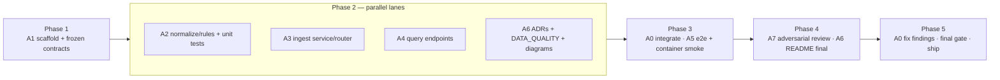

> **Note** — this is the original planning document, included verbatim as an appendix to [APPROACH.md](APPROACH.md). It was written before implementation started and drove the whole build; the few numbers it estimates from early profiling were later corrected by measurement (see DATA_QUALITY.md — the corrections are part of the story).

# FreshFlow Engineering Challenge — Implementation Plan & Specification

**Author:** CTO/Principal Engineer (orchestrator)
**Date:** 2026-08-16
**Status:** Ready for review — implementation to be executed autonomously by an agent team

---

## 1. Challenge analysis

The task: build a containerized Python service with API endpoints to (1) ingest four CSV files and (2) return order recommendations for a given store and day. `docker build` + `docker run` must be sufficient to run it.

The stated task is deliberately simple. The real test is in the data. Profiling all four files revealed systematic, seeded data-quality problems — the challenge is evaluating engineering judgment about validation, normalization, and honest reporting, not CRUD plumbing.

### 1.1 Data profile (measured, not assumed)

| File | Rows | Key findings |
|---|---|---|
| `items.csv` | 50 | Category casing variants (`Fruits`/`fruits`/`FRUITS`); trailing whitespace in names (`"Cucumber  "`) |
| `inventory.csv` | 25,868 | 8 `store_id` spelling variants (case + leading/trailing whitespace); **803 rows in `DD/MM/YYYY`** format amid ISO dates; **~22,400 fractional quantities** (`16.4` pieces) despite "all quantities are in pieces"; 120 duplicate keys (identical values); item `1099` not in catalog |
| `order_recommendations.csv` | 25,627 | Same store_id variants; **item_number as float strings** (`"1001.0"`); **515 negative** recommended quantities; 295 duplicate keys (identical values); items `1099`, `9901–9903` not in catalog; delivery is ordering_day **+1 or +2** |
| `orderable_items.csv` | 25,200 | Same store_id variants; tag noise (`new`, `"new  "`, `NEW`, `ON_SALE`…); category casing noise; 195 duplicate keys; item `1099` not in catalog |

Referential findings: ~3,621 recommendation keys have no matching orderable window and ~3,294 orderable windows have no recommendation. Date-format evidence (`23/01/2024`, `31/12/2024`) confirms slash dates are **day-first** (`DD/MM/YYYY`).

All duplicate keys carry **identical** values → safe silent dedupe (counted). No conflicting duplicates exist, but a policy is still defined (§4.3) because production data would have them.

### 1.2 Interpretation → design principle

The service must **normalize what is unambiguously fixable, quarantine what is not, and report everything**. Silently swallowing bad rows or blindly crashing on them would both be wrong answers. Every ingest returns a machine-readable quality report; quarantined rows remain queryable for audit.

---

## 2. Architecture & technology decisions

**ADR policy: every architectural or technology decision is captured as an ADR** in `docs/adr/`, using the MADR template (context → options with pros/cons → decision → consequences). This includes decisions that emerge during implementation — an agent that makes a non-trivial choice writes a micro-ADR in the same commit. ADR-001–006 below are the up-front decisions; ADR-007–012 (§2.1) capture the finer-grained policies; the numbering continues for anything discovered in flight.

### ADR-001: Web framework — **FastAPI** ✅

| Option | Pros | Cons |
|---|---|---|
| **FastAPI** ✅ | Auto OpenAPI/Swagger docs; Pydantic v2 request/response validation for free; async-capable; current industry default for Python APIs; type-hints end to end | Slightly more machinery than Flask for a tiny service |
| Flask | Minimal, universally known | Manual validation, manual docs, sync-only by default; feels dated for a green-field 2026 service |
| Django + DRF | Batteries included, admin UI | Massive overkill for 2 endpoints; slow to scaffold |

**Decision:** FastAPI + Uvicorn. The free OpenAPI docs double as part of the documentation deliverable.

### ADR-002: Storage — **SQLite via SQLAlchemy 2.0** ✅

| Option | Pros | Cons |
|---|---|---|
| **SQLite** ✅ | Zero-dependency, keeps the "docker build + docker run" contract with **one** container; ACID; plenty for ~75k rows; file can live on a mounted volume | Not multi-writer; not what you'd pick at real scale |
| PostgreSQL | Production-realistic, concurrent writes | Requires docker-compose or a second container — violates the simplest reading of the run contract |
| In-memory (dicts/pandas) | Fastest to build | Data lost on restart; no SQL query surface; hides the interesting persistence design |

**Decision:** SQLite through **SQLAlchemy 2.0 (typed ORM)** so the engine is swappable to Postgres by changing one URL. DB file path configurable via env var (`FRESHFLOW_DB_PATH`), defaulting inside the container with volume-mount support.

### ADR-003: Ingestion strategy — **Normalize + quarantine** ✅ (user-confirmed)

| Option | Pros | Cons |
|---|---|---|
| **Normalize + quarantine** ✅ | Maximum usable data; deterministic, documented rules; full transparency via ingest report; audit trail | Most code; requires explicit policy per defect class |
| Strict reject-file | Clean contract | With these files, *nothing* would ever load — useless service |
| Load as-is, clean on read | Fast to write | Cleaning logic duplicated across every query path; garbage persisted |

### ADR-004: CSV upload contract — **multipart upload with explicit dataset kind**

| Option | Pros | Cons |
|---|---|---|
| **`POST /ingest/{dataset}` multipart file** ✅ | Explicit, self-documenting, per-file reports, idempotent re-ingest per dataset | Four calls to load everything (fine; also offer a convenience combined endpoint) |
| Single endpoint w/ filename sniffing | One call | Magic; breaks when files are renamed |
| Server-side path loading | Trivial | Not really an API; couples client and server filesystems |

Ingest is **replace-per-dataset** (idempotent): re-uploading a dataset atomically replaces its rows in a transaction. Simpler and more predictable than merge semantics for this challenge; documented in the ADR.

### ADR-005: Processing pipeline — stdlib `csv` streaming, not pandas

Streaming `csv.DictReader` + Pydantic row models keeps memory flat, gives precise per-row error attribution (row number in report), and avoids a 100 MB pandas dependency in the image. Pandas would be justified for analytics, not row-wise validation.

### ADR-006: Testing — pytest + httpx TestClient + real-data fixtures + container smoke test

Details in §6.

### 2.1 Fine-grained decision ADRs (007–012)

| ADR | Decision | Alternatives considered |
|---|---|---|
| **ADR-007** | Slash dates parsed **day-first** (`DD/MM/YYYY`) | Month-first (refuted by `23/01/2024`, `31/12/2024` in data); reject all slash dates (would quarantine 803 recoverable rows) |
| **ADR-008** | Fractional inventory **stored exactly** (Decimal), warned, rounded int exposed as `current_inventory` | Round at ingest (destroys information); quarantine (22k rows lost for a plausible weight-based artifact) |
| **ADR-009** | Ingest is **replace-per-dataset**, atomic transaction | Append/merge semantics (ambiguous conflict handling, non-idempotent re-runs); versioned datasets (overkill here, noted as production path) |
| **ADR-010** | Quarantine persisted as **raw row JSON + reason codes**, queryable via API | Log-only (not auditable); reject-file response only (report lost after the request) |
| **ADR-011** | Errors follow **RFC 9457** `application/problem+json` shape | Ad-hoc `{"error": …}` bodies (non-standard); FastAPI default `{"detail": …}` only (kept for 422 validation, wrapped for the rest) |
| **ADR-012** | Toolchain: **uv, ruff (lint+format), mypy --strict, pytest, pre-commit-style CI gates** | pip/poetry (slower, more config); black+flake8+isort (ruff subsumes all three); no type checking (unacceptable for a typed codebase) |

### 2.2 Code quality standard (enforced, not aspirational)

- **Python 3.12 idioms:** full type annotations on every function (PEP 695 syntax where natural), `pathlib` over `os.path`, `Enum`/`StrEnum` for reason codes and dataset kinds, `dataclass`/Pydantic models over dict-passing, context managers for sessions, no mutable default arguments, f-strings, structured logging (`logging` with per-module loggers) — no `print`.
- **Documentation in code:** every module opens with a purpose docstring; every public function/class has a Google-style docstring (args, returns, raises); the normalization/quarantine rule functions each cite their rule ID (N1–N7 / Q1–Q5) in the docstring so code, tests, and DATA_QUALITY.md stay traceable.
- **Readability:** small pure functions for rules; services orchestrate, routers stay thin (no business logic in endpoints); explicit names over comments explaining bad names.
- **Enforcement:** `ruff check` (rule set incl. pycodestyle, pyflakes, isort, pep8-naming, pydocstyle for public APIs, bugbear) and `mypy --strict` on `app/` are **CI-blocking quality gates** alongside tests — code that isn't clean doesn't merge, regardless of which agent wrote it.

---

## 3. API specification

Base path `/api/v1`. All responses JSON. Errors follow RFC 9457 (`application/problem+json`-style body).

### 3.1 `POST /api/v1/ingest/{dataset}`

`dataset ∈ {items, inventory, orderable-items, order-recommendations}`. Body: `multipart/form-data`, field `file` (CSV). Replaces the dataset atomically.

**200 response — ingest report:**

```json
{
  "ingest_id": "8f2c…",
  "dataset": "order-recommendations",
  "received_rows": 25627,
  "loaded_rows": 24398,
  "deduplicated_rows": 295,
  "quarantined_rows": 934,
  "normalizations": {
    "store_id_cleaned": 738,
    "item_number_float_coerced": 655,
    "date_format_converted": 0,
    "value_whitespace_stripped": 0,
    "casing_normalized": 0
  },
  "quarantine_summary": {
    "negative_quantity": 515,
    "unknown_item": 419
  },
  "warnings": ["3621 recommendations reference no orderable window (loaded; flagged)"]
}
```

*(Numbers illustrative; exact values asserted in tests from the real files.)*

- `400` — not a CSV / wrong or missing header columns (report lists expected vs found)
- `409` — ingesting a per-store dataset before `items` **is allowed** but unknown-item quarantine counts will reflect the empty catalog; the report carries a warning recommending items-first order. (No hard ordering dependency — documented.)

### 3.2 `GET /api/v1/stores/{store_id}/recommendations?day=YYYY-MM-DD`

"Day" = **ordering day**. `store_id` is normalized on input (case/whitespace-insensitive).

**200 response:**

```json
{
  "store_id": "store_a",
  "day": "2024-01-01",
  "count": 42,
  "recommendations": [
    {
      "item_number": 1001,
      "item_name": "Organic Bananas",
      "category": "Fruits",
      "is_bio": false,
      "recommended_quantity": 18,
      "delivery_day": "2024-01-02",
      "current_inventory": 16,
      "purchase_price": 0.89,
      "suggested_retail_price": 1.49,
      "orderable": true,
      "tags": []
    }
  ]
}
```

Enrichment: item catalog join; same-day inventory if present (`current_inventory`, nullable); orderable window join (`orderable`, `tags`, window prices override catalog prices when present). `404` for unknown store; `422` for malformed day; empty list (not 404) for a valid store/day with no recommendations.

### 3.3 Supporting endpoints

- `GET /api/v1/ingest/{ingest_id}` — re-fetch a past ingest report
- `GET /api/v1/ingest/{ingest_id}/quarantine?limit&offset` — quarantined raw rows with reasons (audit)
- `GET /api/v1/stores` — known stores with row counts
- `GET /health` — liveness (used by Docker `HEALTHCHECK`)
- `GET /docs`, `GET /openapi.json` — auto-generated

---

## 4. Data model & normalization rules

### 4.1 Tables

- `items(item_number PK, name, category, is_bio, purchase_price, suggested_retail_price)`
- `inventory(store_id, item_number, day, quantity NUMERIC, id PK)` — unique `(store_id, item_number, day)`
- `orderable_items(store_id, item_number, ordering_day, delivery_day, purchase_price, suggested_retail_price, profit_margin, tags JSON, category)` — unique `(store_id, item_number, ordering_day)`
- `order_recommendations(store_id, item_number, ordering_day, delivery_day, recommended_quantity INT)` — unique `(store_id, item_number, ordering_day)`
- `ingest_jobs(ingest_id PK, dataset, created_at, report JSON)`
- `quarantine_rows(id PK, ingest_id FK, row_number, raw_row JSON, reasons JSON)`

Indexes on every `(store_id, *_day)` query path.

### 4.2 Normalization rules (deterministic, unit-tested individually)

| # | Field | Rule | Counted as |
|---|---|---|---|
| N1 | `store_id` | strip → lowercase (`" STORE_A "` → `store_a`) | normalization |
| N2 | `item_number` | `"1001.0"` → `1001` only when fractional part is exactly zero; else quarantine | normalization |
| N3 | dates | try ISO `YYYY-MM-DD`, then `DD/MM/YYYY` (day-first proven by data); else quarantine | normalization |
| N4 | `category` / `tags` | strip → canonical casing (`Fruits`, `new`); tags split, deduped, lowercased | normalization |
| N5 | text fields | strip surrounding whitespace | normalization |
| N6 | inventory `quantity` | parse as Decimal; **stored exactly as given** (fractional pieces are real information — likely weight-based items); flagged in report as `fractional_quantity` warning count; API exposes rounded int (`current_inventory`) alongside nothing lost in DB | warning |
| N7 | exact-duplicate key rows (identical payload) | keep first, count | dedup |

### 4.3 Quarantine rules (row rejected, stored raw with reasons)

| # | Condition | Reason code |
|---|---|---|
| Q1 | `recommended_quantity < 0` | `negative_quantity` |
| Q2 | `item_number` not in catalog at query…ingest time (`1099`, `9901–9903`) | `unknown_item` |
| Q3 | unparseable date / number / missing required field | `invalid_value` / `missing_field` |
| Q4 | duplicate key with **conflicting** payload | `conflicting_duplicate` (both kept in quarantine, first loaded, warning raised) |
| Q5 | `delivery_day < ordering_day` | `invalid_date_order` |

Cross-file referential gaps (recommendation without orderable window) are **loaded but flagged** as warnings — they are plausible business states, not row defects.

Every rule and threshold lives in one module (`app/ingest/rules.py`) — single source of truth referenced by docs and tests.

---

## 5. Repository layout

```
freshflow-service/
├── app/
│   ├── main.py                 # FastAPI app factory, lifespan, routers
│   ├── config.py               # pydantic-settings (DB path, log level)
│   ├── db.py                   # engine/session, SQLAlchemy Base
│   ├── models/                 # ORM models (one file per table group)
│   ├── schemas/                # Pydantic request/response models
│   ├── ingest/
│   │   ├── parser.py           # streaming CSV reading, header validation
│   │   ├── normalize.py        # N1–N7 pure functions
│   │   ├── rules.py            # quarantine rules Q1–Q5, reason codes
│   │   ├── service.py          # orchestration: parse→normalize→validate→load, report building
│   │   └── router.py
│   ├── recommendations/
│   │   ├── service.py          # query + enrichment joins
│   │   └── router.py
│   └── stores/router.py
├── tests/
│   ├── unit/                   # normalize, rules, parser (pure, no DB)
│   ├── integration/            # TestClient + tmp SQLite, fixture CSVs
│   ├── e2e/test_real_data.py   # full real CSVs, exact expected counts
│   └── fixtures/               # small handcrafted dirty CSVs per defect class
├── data/                       # the four challenge CSVs (for e2e + demo)
├── docs/
│   ├── PROBLEM_ANALYSIS.md     # junior-friendly domain & problem explanation
│   ├── DATA_GUIDE.md           # junior-friendly data description + cleansing rationale
│   ├── ARCHITECTURE.md         # C4 container + component, Mermaid
│   ├── adr/ADR-001…012+.md      # MADR template; grows with in-flight decisions
│   ├── DATA_QUALITY.md         # profiling findings + rule mapping
│   └── diagrams (Mermaid: ERD, ingest sequence, request flow)
├── scripts/load_all.sh         # curl demo: ingest all four files + sample query
├── Dockerfile                  # multi-stage, non-root, HEALTHCHECK
├── docker-compose.yml          # optional convenience (volume for DB)
├── pyproject.toml              # uv-compatible; ruff + pytest config
├── .github/workflows/ci.yml   # lint + tests + docker build
└── README.md                   # quickstart, API examples, design summary
```

**Toolchain:** Python 3.12, `uv` for dependency management, `ruff` (lint + format), `mypy --strict`, `pytest` + `pytest-cov`, `hadolint` for the Dockerfile, multi-stage Dockerfile (`python:3.12-slim` runtime, non-root user, `HEALTHCHECK`). Full rule-by-rule verification matrix in §6.1.

---

## 6. Testing strategy

Written **with** the implementation by the same agents (test-alongside, not test-after); the QA agent adds the cross-cutting layers.

1. **Unit** — every normalization rule (N1–N7) and quarantine rule (Q1–Q5) as pure-function tests with table-driven cases, including the nasty ones found in profiling (`" STORE_A "`, `"1001.0"`, `23/01/2024`, `-5`).
2. **Integration** — FastAPI TestClient against a temp SQLite: ingest handcrafted dirty fixture CSVs, assert exact report numbers; query endpoints, assert enrichment, 404/422 behavior, store_id-insensitivity, replace-on-reingest idempotency.
3. **E2E real data** — ingest the four actual challenge files; assert exact totals (rows loaded / deduped / quarantined per reason) pinned from profiling; spot-check known rows (e.g. store_a / 2024-01-01 / item 1001 → qty 18, delivery 2024-01-02).
4. **Container smoke** — build the image, run it, curl `/health`, ingest, query — scripted in CI and in `scripts/`.
5. **Coverage gate** ≥ 90% on `app/`; ruff clean.

### 6.1 Verification & enforcement matrix — how every rule is checked

Every standard in this plan has a named verification mechanism. Nothing is "by convention"; if it can't be checked, it isn't a rule.

| What is verified | How | Tool & configuration | Gate |
|---|---|---|---|
| Code style, imports, naming, common bugs, docstring presence/format | Static lint | **ruff** — `select = ["E","W","F","I","N","B","UP","SIM","C4","RUF","D"]`, `pydocstyle.convention = "google"`, `target-version = "py312"`; `per-file-ignores` relax `D` in `tests/` | CI job `lint`, blocking |
| Formatting consistency | Format check | `ruff format --check` | CI job `lint`, blocking |
| Type correctness, no untyped defs, no implicit Any | Static typing | **mypy** — `strict = true` on `app/` (`disallow_untyped_defs`, `no_implicit_optional`, `warn_return_any`, `warn_unused_ignores`) | CI job `typecheck`, blocking |
| Normalization rules N1–N7 | 1:1 named unit tests (`test_n1_store_id_…` …) with table-driven cases using the literal dirty values found in profiling | **pytest**, `tests/unit/` | CI job `test`, blocking |
| Quarantine rules Q1–Q5 | Same pattern: one test module per rule, reason-code assertions | pytest, `tests/unit/` | CI job `test`, blocking |
| Rule ↔ code ↔ docs traceability | Rule IDs cited in docstrings; a meta-test greps `app/ingest/` and asserts every ID N1–N7/Q1–Q5 appears in exactly one implementing function and one test module | pytest meta-test | CI job `test`, blocking |
| API contract (§3) | Integration tests per endpoint: status codes, response schemas (Pydantic round-trip), 404/422/empty-list semantics, store-id-insensitivity, re-ingest idempotency | pytest + httpx TestClient, tmp SQLite | CI job `test`, blocking |
| OpenAPI schema validity | Generated `openapi.json` validated + committed snapshot diffed (contract drift is an explicit test failure, not a surprise) | pytest snapshot test | CI job `test`, blocking |
| Real-data correctness | e2e ingest of the four actual CSVs; reports asserted against `tests/e2e/expected_counts.json` (generated by a committed, standalone profiling script — counts are derived twice, independently) | pytest `-m e2e` | CI job `e2e`, blocking |
| Line & branch coverage | `pytest --cov=app --cov-branch --cov-fail-under=90` | pytest-cov | CI job `test`, blocking |
| Dockerfile best practices (pinned base, no root, no cache bloat) | Dockerfile lint | **hadolint** | CI job `docker`, blocking |
| Container actually works | Build → run → `curl /health` → ingest all four files → query recommendations → assert JSON | smoke script, pytest `-m smoke` | CI job `docker`, blocking |
| Image hygiene | Final stage is `python:3.12-slim`, non-root `USER`, `HEALTHCHECK` present — asserted by smoke test inspecting the image (`docker inspect`) | smoke script | CI job `docker`, blocking |
| ADR completeness | A7 review checklist: every decision in PLAN.md §2/§2.1 and every in-flight decision has an ADR file; each ADR contains Context/Options+pros-cons/Decision/Consequences sections (structure checked by a docs meta-test) | pytest docs test + A7 review | Gate 5/6 |
| README accuracy | A6/A7 literally execute the quickstart commands from a clean checkout; all numbers in docs must be program output | manual protocol in review report | Gate 5/6 |
| Commit hygiene | Conventional-commit format checked over `git log` in the final gate | A0 final gate script | Gate 6 |

**CI pipeline** (`.github/workflows/ci.yml`), fail-fast ordering: `lint` → `typecheck` → `test` (unit+integration+coverage) → `e2e` → `docker` (hadolint + build + smoke). The same commands run locally via `uv run` one-liners documented in the README, so agents verify before committing — CI confirms, it doesn't discover.

---

## 7. Agent team

Design principle: **contracts first, then parallel lanes on disjoint files.** Phase 1 freezes every interface (schemas, module signatures, table DDL) so Phase 2 agents cannot collide. Merge conflicts are designed out, not resolved.

### 7.1 Roles

| Agent | Role | Skills | Owns (files) |
|---|---|---|---|
| **A0 Orchestrator** (session lead) | Sequencing, contract enforcement, merge, final gate | architecture, review | task graph, integration branch |
| **A1 Platform** | Scaffold repo, pyproject, config, db.py, ORM models, Dockerfile, CI, health endpoint | Python packaging, Docker, SQLAlchemy | scaffold + `models/` + `Dockerfile` + CI |
| **A2 Data engineer** | Normalization + quarantine rules + parser, with exhaustive unit tests | data wrangling, Pydantic, property-based testing | `app/ingest/{parser,normalize,rules}.py`, `tests/unit/` |
| **A3 Backend — ingest** | Ingest service + router + report building + integration tests | FastAPI, transactions, streaming IO | `app/ingest/{service,router}.py`, `tests/integration/test_ingest*` |
| **A4 Backend — query** | Recommendations/stores endpoints, enrichment joins + integration tests | FastAPI, SQL query design | `app/recommendations/`, `app/stores/`, `tests/integration/test_query*` |
| **A5 QA** | E2E real-data suite with pinned counts, container smoke test, coverage gate | pytest, Docker, adversarial testing | `tests/e2e/`, `scripts/`, smoke workflow |
| **A6 Tech writer** | README, ARCHITECTURE.md, ADRs, DATA_QUALITY.md, all Mermaid diagrams | technical writing, C4/Mermaid | `docs/`, `README.md` |
| **A7 Reviewer** | Adversarial review vs. spec + acceptance checklist; verify claimed test results independently | code review, security, spec compliance | review report (no code ownership) |

### 7.2 Execution phases & parallelism



- **Phase 1 (serial, small):** A1 scaffolds; A0 freezes contracts: exact Pydantic schemas, function signatures of `normalize.py`/`rules.py`/`service.py`, ORM DDL, router paths. Contracts are committed as stub files with docstrings + `NotImplementedError`.
- **Phase 2 (4 lanes parallel):** A2, A3, A4, A6 work only inside their owned files. A3/A4 code against A2's frozen signatures and A1's models. A6 writes everything except final README numbers.
- **Phase 3:** A0 integrates; A5 runs the full pyramid incl. real-data counts and Docker smoke test; failures return to the owning lane.
- **Phase 4:** A7 reviews adversarially (spec compliance, error paths, security basics: file-size limit on upload, no SQL injection surface, non-root container); A6 finalizes README with real report numbers.
- **Phase 5:** A0 fixes confirmed findings, re-runs the full gate, commits clean history, delivers.

### 7.3 Model assignment per agent — capability matched to task, spelled out

Principle: a model tier is chosen by the **ambiguity and judgment content** of the task, not the volume of code. Well-specified implementation against frozen contracts is exactly what mid-tier models do reliably and cheaply; the top tier is reserved for the tasks where subtle mistakes are expensive and hard to detect — orchestration trade-offs, defect-sensitive data logic, and adversarial verification.

| Agent | Model | Reasoning effort | Why this tier is enough — and why not less |
|---|---|---|---|
| A0 Orchestrator | **Fable** (session model) | high | Contract design, cross-lane integration, gate enforcement, in-flight ADR decisions — the highest-judgment work in the project. Errors here multiply into every lane. |
| A1 Platform | **Sonnet** | medium | Scaffolding, pyproject, Dockerfile, CI, ORM DDL — fully specified in the plan, heavily-trodden patterns. Opus would add cost, not correctness. Haiku would risk subtle config errors (mypy strict setup, multi-stage Docker) that cost more to debug than the savings. |
| A2 Data engineer | **Opus** | high | The heart of the challenge: normalization/quarantine rules where off-by-one judgment (is `"1001.5"` coercible? is `01/05/2024` ambiguous?) silently corrupts data. Cheapest place for a bug to be expensive → one tier above the other lanes. Fable reserved for A0/A7 where judgment is even less specifiable. |
| A3 Backend ingest | **Sonnet** | medium | Transactional load + report building against A2's frozen rule functions and an exact report schema. Well-specified FastAPI work. |
| A4 Backend query | **Sonnet** | medium | Enrichment joins and endpoint semantics, fully specified in §3.2. Same reasoning as A3. |
| A5 QA | **Sonnet** | high | Test authoring against an explicit checklist and pinned counts; high effort because adversarial test design benefits from deeper search, but the task is well-bounded so Sonnet suffices. |
| A6 Tech writer | **Sonnet** | medium | Documentation from existing decided content (plan, ADR tables, this analysis). Strong writing, no novel judgment. |
| A7 Reviewer | **Fable** | high | Adversarial verification is the hardest cognitive task in the pipeline: finding what seven other agents missed. The strongest model goes where verification happens — a weaker reviewer rubber-stamps. |

No lane gets Haiku: every lane owns correctness-critical output, and the cost delta between Haiku and Sonnet is far below the cost of one subtle scaffold or test bug slipping to Phase 5.

### 7.4 Quality gates (all must pass before "done")

1. `docker build` + `docker run` from a clean checkout; `curl /health` OK
2. `scripts/load_all.sh` ingests all four real CSVs; reports match pinned expected counts
3. Recommendations query returns enriched, correct data for spot-checked store/days; store-id-variant inputs (`STORE_A `) resolve
4. Full verification matrix (§6.1) green: `ruff check` + `ruff format --check`, `mypy --strict`, `pytest` incl. coverage ≥ 90% (line+branch), traceability meta-test, OpenAPI snapshot, hadolint
5. Docs complete: README quickstart verified by literally following it; **every architectural/tech decision has an ADR** (001–012 minimum, plus any made in flight); ARCHITECTURE.md with ≥3 Mermaid diagrams (container, ERD, ingest sequence); DATA_QUALITY.md maps every measured defect to its rule
6. A7 review report: zero unresolved CONFIRMED findings

---

## 8. Acceptance criteria (deliverable definition)

1. **Working solution:** containerized FastAPI service; `POST /api/v1/ingest/{dataset}` for the four CSVs with full normalize/quarantine reporting; `GET /api/v1/stores/{store}/recommendations?day=…` with enrichment; health + docs endpoints; runs with `docker build && docker run -p 8000:8000`.
2. **Tests:** unit + integration + e2e-real-data + container smoke, green, ≥90% coverage.
3. **Documentation:** README, ARCHITECTURE.md (Mermaid diagrams), a complete ADR set (≥12, MADR format) with alternatives and pros/cons for **every** architectural/tech decision including those made during implementation, DATA_QUALITY.md.
4. **Delivery:** git-initialized repo with clean conventional commits at `/Users/andizink/projects/freshflow/freshflow-service`.

## 9. Risks & mitigations

| Risk | Mitigation |
|---|---|
| Parallel agents drift from contracts | Contracts frozen as committed stubs in Phase 1; A0 rejects any lane touching non-owned files |
| Pinned e2e counts wrong | Counts derived from independent profiling script committed to `tests/e2e/expected_counts.json` with the generator script |
| Ambiguous slash dates (`01/05/2024`) | Policy: single format per file family, day-first (proven by `23/01/2024`); documented in ADR + DATA_QUALITY |
| Docker not available to test in some environment | Smoke test isolated in its own marker (`-m smoke`) so the rest of the suite is environment-independent |
